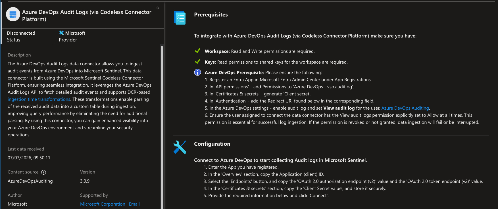
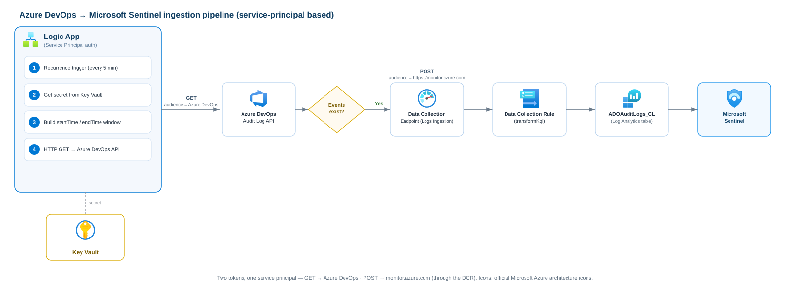
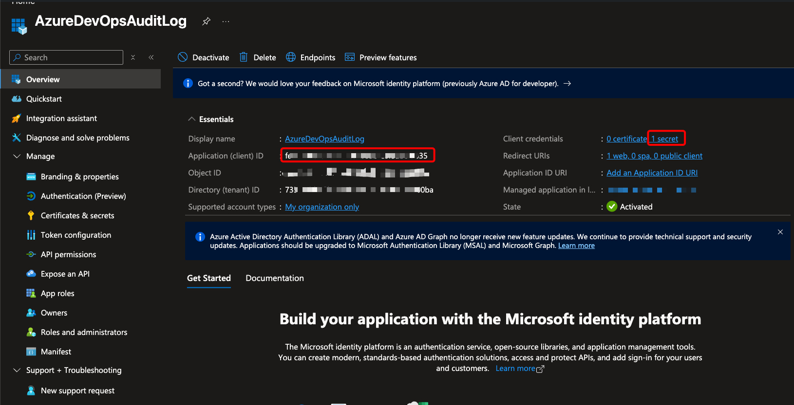
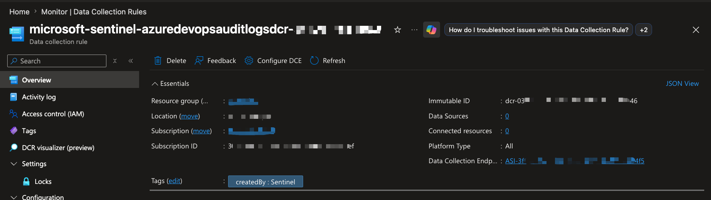
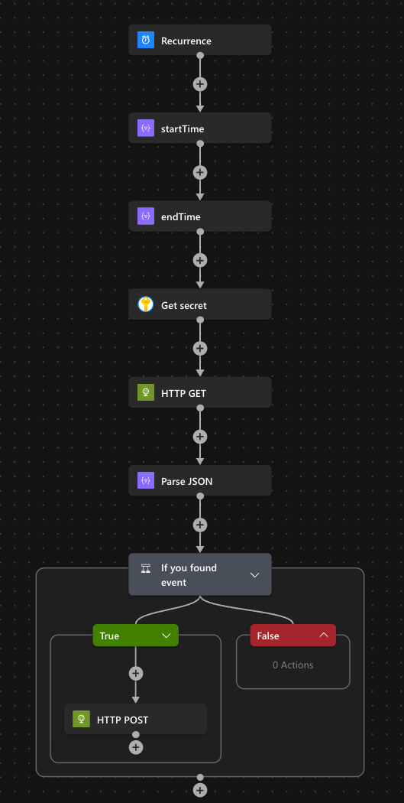
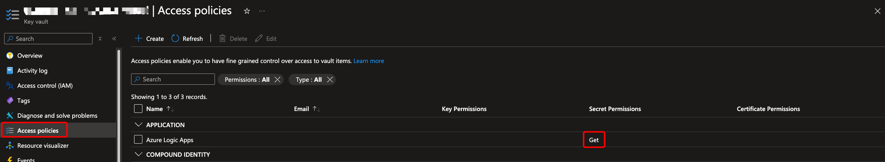

---

title: "No Account, No Problem - Ingesting Azure DevOps Audit Logs into Sentinel with a Service Principal"  
description: "Microsoft's Azure DevOps Audit Logs connector for Sentinel forces you to sign in with a user account. Here's how I ditched that requirement and built a secret-free, service-principal-based ingestion pipeline from scratch with a Logic App, a DCR, and Key Vault."  
date: 2026-07-06  
image: cover.png  
categories:  
    - Azure  
tags:  
    - Microsoft Sentinel  
    - Azure DevOps  
    - Logic Apps  
    - Data Collection Rule  
    - Service Principal  
    - Key Vault

---

# No Account, No Problem: Ingesting Azure DevOps Audit Logs into Sentinel with a Service Principal

🕑 *Reading time: ~10 minutes*

{{}} *Short version: the native Azure DevOps Audit Logs connector for Microsoft Sentinel is a governance headache waiting to happen. Here's how I tossed it out and rolled my own pipeline that runs entirely on a service principal - no user sign-in, no sketchy service account, and by the end, no secrets sitting around in clear text either.* {{}}

📚 **Not here for the theory?** Skip straight to [The Build](#-the-build-step-by-step).

---
 


## ⚠️ Why I Refused to Use the Connector's Account

Microsoft Sentinel ships with a codeless connector called **Azure DevOps Audit Logs (via Codeless Connector Platform)**. 

Looks handy on paper. But the second you hit **Connect**, it drags you through an **OAuth authorization-code** flow and makes you **sign in with an account**. Whatever account you pick becomes the identity that reads your audit logs. Forever.

And here's the thing - every option Microsoft leaves on the table is bad news from a security and ops point of view:


| Option                       | Why it's a problem                                                                                                                                                                                                                                                  |
| ---------------------------- | ------------------------------------------------------------------------------------------------------------------------------------------------------------------------------------------------------------------------------------------------------------------- |
| **My own user account**      | The day I revoke my sessions, rotate my password, or walk out the door, that refresh token dies and **your logs silently dry up**. Pinning an org-wide security feed to one human being is a single point of failure, full stop.                                    |
| **A shared service account** | Congrats, now you own a licensed user with a password, an MFA exclusion (because automation breaks otherwise), and a long-lived refresh token. That's exactly the kind of standing credential attackers dream about. Service accounts are **not** the move in 2026. |
| **App Client ID only**       | Not happening - the authorization-code flow **demands** an interactive user login. You can't just hand it a client ID and call it a day.                                                                                                                            |


So I ditched the connector entirely and built the whole pipeline **from scratch on a Service Principal (App Registration)**. It authenticates non-interactively, its permissions are spelled out and tightly scoped, and in the final step I shove its secret into **Key Vault** so nothing sensitive ever lives in plain sight.

{{}}Azure DevOps audit events still land in Sentinel through the **exact same custom table** the connector would've used (`ADOAuditLogs_CL`) - but the identity behind the wheel is a service principal I fully own. No human, no service account, no nasty revocation surprises down the road. {{}}

---


## How the Pipeline Works

Before we get our hands dirty, here's the mental model. The Logic App is just the orchestrator - it doesn't write anything itself. The data actually lands in Log Analytics through a **Data Collection Rule (DCR)**:

Azure DevOps to Microsoft Sentinel ingestion pipeline built on a service principal: a Logic App reads audit logs via HTTP GET, checks whether events exist, then POSTs them through a Data Collection Endpoint and Data Collection Rule into the ADOAuditLogs_CL table in Microsoft Sentinel, with the secret stored in Key Vault


Two different tokens, one service principal:

- the **GET** grabs a token for **Azure DevOps** (resource ID `499b84ac-1321-427f-aa17-267ca6975798`),
- the **POST** grabs a token for `https://monitor.azure.com` to write through the DCR.

🚨 The DCR is **not optional** - don't skip it. You can't POST straight into a custom table if you do not have a DCR.  
The Logs Ingestion API always writes *through* a DCR, which checks the incoming schema, runs an optional KQL transform, and routes the rows into the destination table.

---


## The Build (Step by Step)


### Prerequisites

Before starting building the process we need:

- Azure DevOps organization sits on the **same Entra ID tenant** as your Azure subscription.
- **Auditing is turned on** on AzureDevOps site (`Organization Settings → Policies → Log audit events`).
- **Log Analytics workspace** on Microsoft Sentinel.
- Permissions: 
  - **Owner/Contributor** on the resource grou 
  - **Project Collection Administrator** on Azure DevOps.

---


### Create the App Registration

1. **Entra ID → App registrations → New registration**. 
Name it something obvious like `AzureDevOpsAuditLog`.
2. Copy the **Application (client) ID** and the **Directory (tenant) ID** 
3. Head to **Certificates & secrets → New client secret**, and copy the **Value** (the value, *not* the Secret ID - and copy it now, because you only get to see it once).

💡 Stash that secret somewhere safe for the moment. In **Step 6** we'll tuck it into Key Vault so it never lives inside the workflow.


---


### Add the Service Principal to Azure DevOps


Azure DevOps treats service principals and managed identities as first-class members of an organization, so we hand it access exactly like we would a regular user.


Before you start, a heads-up on permissions: this step is **admin territory**. To add a member to the organization, set its access level, and manage group membership, you need to be a **Project Collection Administrator (PCA)** - or the **Organization Owner** - on the Azure DevOps org. 
A regular user account can't do any of this. If you're not a PCA, you'll need someone who is to run these steps for you (or to grant you the role first).


1. Navigate over `dev.azure.com/<your-org>` → **Organization Settings → Users → Add users**.
2. Search for the app by **name** (`AzureDevOpsAuditLog`) or by **Client ID**, and set **Access level = Basic**.
3. Give it the right to **read the audit log**. 
Auditing lives at the organization level, so drop the service principal into a group that can read it (for example **Project Collection Administrators**).

---


### Find the DCR & Copy the Log Ingestion Endpoint

If you'd already given the native connector a shot, Sentinel has quietly created a DCR for you (mine was tagged `createdBy: Sentinel`) that points to `ADOAuditLogs_CL`. 
You can **reuse that one** or build your own dedicated DCR - either way, you need three values out of it.

The DCR declares its input stream as `Custom-ADOAuditLogs` and handles the field mapping itself inside its `transformKql`:

```kql
source
| extend TimeGenerated = todatetime(timestamp)
| project TimeGenerated, ActionId = actionId, ActivityId = activityId, ActorUPN = actorUPN,
          Area = area, Category = category, Data = data, Details = details, Id = id,
          IpAddress = ipAddress, ProjectName = projectName, ScopeType = scopeType /* ...etc... */
```

This is a sweet shortcut: since the transform expects the **raw lowercase fields** exactly the way the Azure DevOps API spits them out (`actionId`, `timestamp`, `data`...), you just forward the API payload **as-is** - zero reshaping in the Logic App.

Pull these three values (portal or CLI, your call):

```bash
RG="<dcr-resource-group>"
DCR="<your-dcr-name>"

# Immutable ID (goes in the POST URL)
az monitor data-collection rule show -g "$RG" -n "$DCR" --query "immutableId" -o tsv

# The input stream name
az monitor data-collection rule show -g "$RG" -n "$DCR" --query "streamDeclarations" -o json

# The DCE this DCR uses -> its Logs Ingestion endpoint
DCE_ID=$(az monitor data-collection rule show -g "$RG" -n "$DCR" --query "dataCollectionEndpointId" -o tsv)
az monitor data-collection endpoint show --ids "$DCE_ID" --query "logsIngestion.endpoint" -o tsv
```


At this point you're holding: the **DCE ingestion endpoint**, the **DCR immutable ID**, and the **stream name** (`Custom-ADOAuditLogs`).

---


### Assign the DCR Permission to the Service Principal

The service principal has to be allowed to write through the DCR, and the role that unlocks that is **Monitoring Metrics Publisher**.

Open the DCR → **Access control (IAM) → Add role assignment → Monitoring Metrics Publisher →** pick your app → **Review + assign**.

Or, if you'd rather stay in the terminal:

```bash
DCR_ID=$(az monitor data-collection rule show -g "$RG" -n "$DCR" --query id -o tsv)

az role assignment create \
  --assignee "<client-id>" \
  --role "Monitoring Metrics Publisher" \
  --scope "$DCR_ID"
```


Role propagation can drag on for **5-10 minutes**. If your first POST comes back **403**, nine times out of ten this is the culprit - grab a coffee and try again.

---


### Build the Logic App

Create a **Logic App**, then wire up this sequence in the designer.

1. **Trigger - Recurrence:** every `5` minutes.

2. **Compose -** `startTime`**:**

```
addMinutes(utcNow(), -5)
```

3. **Compose -** `endTime`**:**

```
utcNow()
```

4. **Get Secret** from Key Vault (next section)

5. **HTTP - GET (read the audit log):**

- **Method:** `GET`
- **URI:**

```
https://auditservice.dev.azure.com/<your-org>/_apis/audit/auditlog?startTime=@{outputs('startTime')}&endTime=@{outputs('endTime')}&api-version=7.2-preview.1
```

- **Authentication → Active Directory OAuth:**


| Field           | Value                                                        |
| --------------- | ------------------------------------------------------------ |
| Authority       | `https://login.microsoftonline.com`                          |
| Tenant          | `<tenant-id>`                                                |
| **Audience**    | `499b84ac-1321-427f-aa17-267ca6975798`                       |
| Client ID       | `<client-id>`                                                |
| Credential type | `Secret`                                                     |
| Secret          | *(the client secret - we swap this for Key Vault in Step 6)* |


6.**Condition - only keep going if there are actually events:**

```
length(body('HTTP_GET')?['decoratedAuditLogEntries'])   is greater than   0
```

7. **HTTP - POST (ship it to Sentinel), inside the True branch:**

- **Method:** `POST`
- **URI:**

```
<DCE-ingestion-endpoint>/dataCollectionRules/<dcr-immutable-id>/streams/Custom-ADOAuditLogs?api-version=2023-01-01
```

- **Headers:** `Content-Type: application/json`
- **Body:**

```
@body('HTTP_GET')?['decoratedAuditLogEntries']
```

- **Authentication → Active Directory OAuth:** same setup as the GET, just switch the **Audience** to `https://monitor.azure.com`.



---


### Move the Secret into Key Vault

Now let's kill that clear-text secret for good.

1. Store the client secret in **Key Vault** as a secret (e.g. `ADOSentinel-LogicApp-Secret`).
2. Add a **Key Vault → Get secret** action right at the top of the workflow.
3. In **both** HTTP actions, replace the `Secret` value with a reference to that action:

```
@{body('Get_secret')?['value']}
```

⚠️ Give the Logic App's connection **Get** permission on the vault's secrets (Key Vault **Access policies** → the *Azure Logic Apps* connection → `Get`).



From this point on there's **no secret anywhere in the workflow definition** - the Logic App fetches it at runtime, and Logic Apps flags that action's inputs/outputs as secured.

---


### Verify Events Land in the SIEM

Kick off the workflow. The POST should hand you back a **204 No Content**. Then jump into **Sentinel → Logs** - just remember `TimeGenerated` equals the *original event time*, so query by ingestion time unless you enjoy chasing your own tail:

```kql
ADOAuditLogs_CL
| where ingestion_time() > ago(30m)
| sort by TimeGenerated desc
```

And because of that intentional window overlap, dedupe on the unique event `Id`:

```kql
ADOAuditLogs_CL
| summarize arg_max(TimeGenerated, *) by Id
```

{{}} Within a minute of a clean POST (give it a touch longer the very first time a custom table gets written to), your Azure DevOps audit events pop up in Sentinel - pulled in by a service principal, with exactly zero standing user credentials behind them. {{}}

---


## Final Considerations

The native connector isn't *broken* - it's just built around an authentication model that has no business being in a security-conscious environment. Chaining an org-wide audit feed to a **human's refresh token** or a **standing service account** is trading long-term risk for short-term convenience, and that's a deal I'm not taking.

Rebuild the pipeline around a **service principal**, an explicit **DCR**, and a **Key Vault**-backed secret, and here's what you walk away with:

- **No interactive login** and no dependency on any single person sticking around.
- **Explicit, scoped permissions** (audit-read on Azure DevOps, `Monitoring Metrics Publisher` on the DCR) that are dead simple to audit and revoke.
- **No secrets in clear text** once the value lives in Key Vault - plus a clean runway to swap it for a certificate or a managed identity later on.

Same destination table, same Sentinel experience - but an identity you actually control. That's the whole point.

{{}} **If the tool Microsoft hands you forces a weak identity model, don't just roll with it - rebuild the plumbing around a principal you can actually govern. A handful of Logic App actions is a tiny price to pay for pulling a standing credential off your attack surface.** {{}}

---

**Sources and References:**

- Azure DevOps Audit Log API: [https://learn.microsoft.com/en-us/rest/api/azure/devops/audit/audit-log](https://learn.microsoft.com/en-us/rest/api/azure/devops/audit/audit-log)
- Logs Ingestion API in Azure Monitor: [https://learn.microsoft.com/en-us/azure/azure-monitor/logs/logs-ingestion-api-overview](https://learn.microsoft.com/en-us/azure/azure-monitor/logs/logs-ingestion-api-overview)
- Data collection rules (DCR) overview: [https://learn.microsoft.com/en-us/azure/azure-monitor/essentials/data-collection-rule-overview](https://learn.microsoft.com/en-us/azure/azure-monitor/essentials/data-collection-rule-overview)
- Service principals & managed identities in Azure DevOps: [https://learn.microsoft.com/en-us/azure/devops/integrate/get-started/authentication/service-principal-managed-identity](https://learn.microsoft.com/en-us/azure/devops/integrate/get-started/authentication/service-principal-managed-identity)
- Authenticate Logic Apps with managed identity / OAuth: [https://learn.microsoft.com/en-us/azure/logic-apps/authenticate-with-managed-identity](https://learn.microsoft.com/en-us/azure/logic-apps/authenticate-with-managed-identity)

