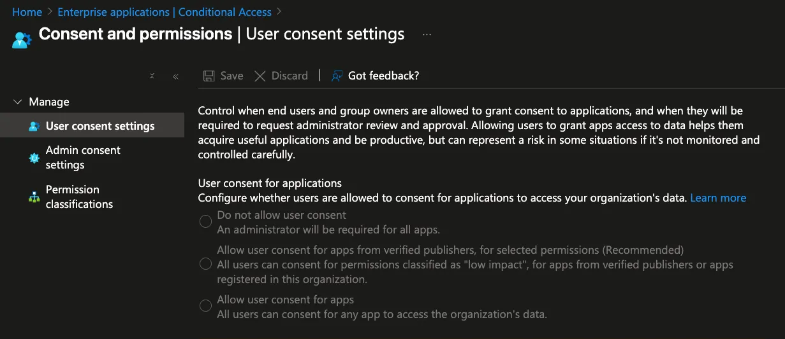
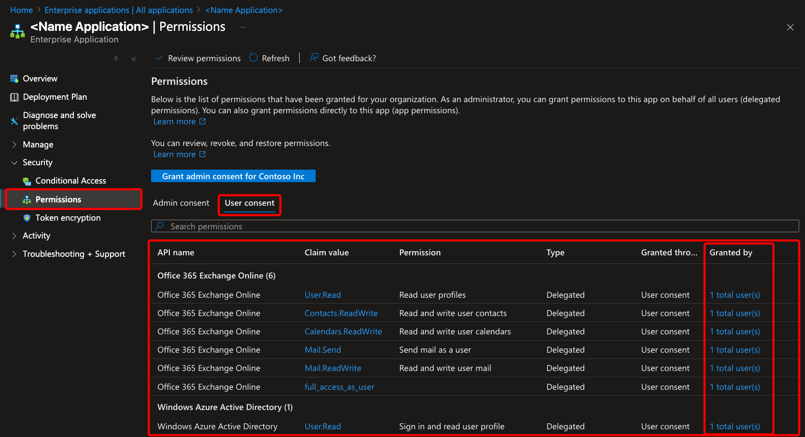
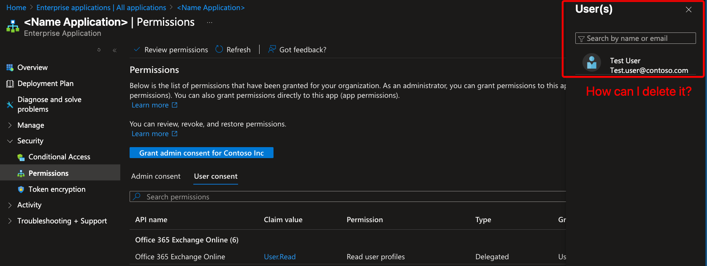
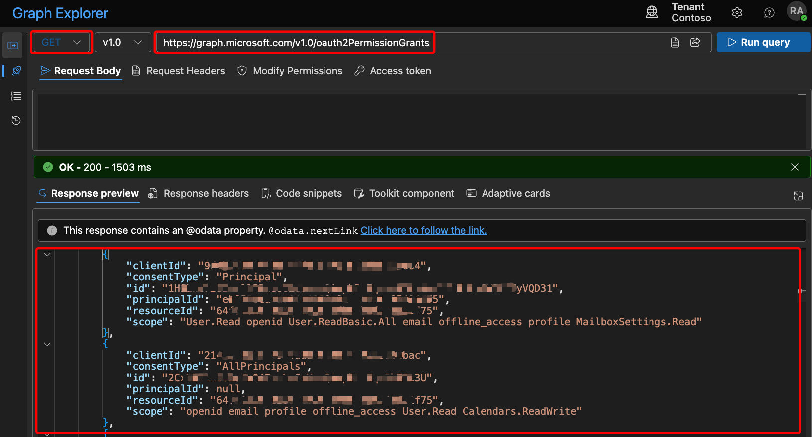
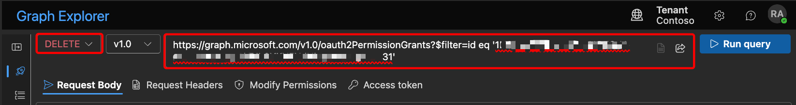

# From Permission Audits to Automated Revocation: Fighting Ghost OAuth Grants in the Cloud

🕑 *Reading time: 34 minutes*

{{<callout> title="📢"}}
*In this guide, you will learn why OAuth app permissions and access tokens can outlive deleted users in Microsoft 365, the security risks of residual grants, and the best practices for identifying and revoking them through monitoring and automation.*


📚
**Skip the Theory?**

If you want to jump straight to the practical steps and recommendations click [here]


### **⚠️ The Risk of Access Delegation in Azure AD Enterprise Applications**

From an advanced cybersecurity standpoint, the management of consent and permissions in Azure AD Enterprise Applications constitutes one of the most critical and frequently overlooked - attack surfaces within enterprise cloud environments. 

Every granted consent, whether at the user or tenant level, potentially opens a backdoor through which data exfiltration and privilege escalation can occur. This risk is particularly acute with high-privilege permissions (such as *Mail.Read*, *Directory.Read.All*, etc.) commonly requested by third-party applications or internal developers.

Modern attacks **no longer focus exclusively on credential theft**, instead, adversaries increasingly exploit previously granted consent grants to legitimize malicious access. This is often achieved through consent phishing (using social engineering to trick users into authorizing rogue apps), or through misconfigurations and a lack of ongoing permissions review. 

Weak governance around consent and permissions can undermine even the strongest authentication and MFA controls, leaving organizations exposed to persistent and silent compromises.

### **Recap of Enterprise Applications & Delegation in Azure AD**

Before delving into the security concerns and mitigation strategies, it is essential to recap what Azure AD Enterprise Applications are, and what is meant by delegation in this context.

**Enterprise Applications** in Azure Active Directory represent the actual instances of applications (both Microsoft and third-party) that have been registered or integrated to authenticate against your organization’s Azure AD tenant. 
These applications act as trust relationships, enabling seamless SSO, automated provisioning, and crucially access to enterprise resources.

**Delegation** refers to the mechanism whereby these applications, once authorized, can act on behalf of users or the organization itself. 
This happens through the granting of specific permissions (consents), allowing the app to perform actions such as reading emails, accessing files, or querying directory information - not just as itself, but impersonating a user or the whole directory, depending on the grant type (delegated vs. application permissions).

{{<callout> title="👉"}}
Understanding the fundamentals of how applications integrate with Azure AD, and how delegation works, is necessary groundwork before assessing the security impact of consent and permissions management.



### User Consent Settings on Azure AD

The “***User consent settings***” area in Azure AD is crucial for managing how and when users or group owners can grant applications the right to access your organization’s data - a pivotal control point for reducing lateral movement and data exfiltration risks.



1. **Do not allow user consent**
    - **Security Perspective:** Strictest. All application permission requests must be reviewed and approved by an administrator. This setting greatly reduces the attack surface for consent phishing and for inadvertent exposure through unvetted apps.
    - **Operational Impact:** Can slow down user productivity and app onboarding because every app integration request is bottlenecked through IT/security.
2. **Allow user consent for apps from verified publishers, for selected permissions (Recommended)**
    - **Security Perspective:** Balanced. Users can only grant consent for apps published by a verified source (Microsoft-certified or tenant-registered) and only for permissions classified as “low impact.” This setting allows flexibility for productivity with significantly reduced risk.
    - **Operational Impact:** Minimizes friction for adopting trusted, low-risk apps while keeping potentially harmful requests under admin control.
3. **Allow user consent for apps**
    - **Security Perspective:** High risk. Any user can grant any app access to organizational data, regardless of publisher or permission scope. This opens the door for abuse via malicious apps, consent phishing, and unintentional data leaks.
    - **Operational Impact:** Fastest for end-users, but at the expense of opening broad attack vectors.

{{<callout> title="👉"}}
It’s important to emphasize that there’s no single “best” configuration for user consent settings that applies to every organization. The optimal choice depends greatly on the specific context of your tenant, your organizational risk appetite, use cases, and operational realities.



### **Microsoft Recommends the “Verified Publishers & Low Permission” Model**

**Microsoft** strongly recommends configuring the second option, “*Allow user consent for apps from verified publishers, for selected permissions (Recommended)*”

The **real advantage** of this setting is that it gives security teams precise control without blocking productivity. Using permission classification, you can define exactly which permissions are considered “low risk” in your environment. Whenever a user or group owner wants to consent to an app, they can do so instantly - but only if the app comes from a trusted, verified publisher and only if it’s requesting one of the **low-impact** permissions you’ve approved.

This approach shrinks your attack surface considerably. Users can adopt helpful, safe apps on their own, with no need to wait for admin approval or get slowed down by bureaucracy. 
At the same time, high-risk permission requests or apps from unknown publishers are automatically flagged for administrator review - so your critical data never gets exposed by accident or through a phishing attempt.

In short, you empower your users to work efficiently with the tools they need, but you keep tight control over anything that could cause harm. 

*This isn’t just Microsoft’s recommendation - it’s one of the most effective ways to enforce security results without putting up unnecessary roadblocks.*

{{<callout> title="⚙"}}
**Where to set permission classifications?**
Navigate to *Permission classifications* to add or edit which permissions are “**low**”, “**medium**”, or “**high**” risk for your organization.



### **👀 How Forgotten Permissions Create Security Blind Spots**

After outlining clear policies for how user consent and permissions are managed, it’s essential from a security standpoint to implement continuous monitoring and strong governance of app permissions within your Azure AD environment. 
Without oversight, seemingly “harmless” permissions can become **“ghost permissions” -** lingering, forgotten access rights that often lead to serious security blind spots.

**Real-world security risks include**

| **Decommissioned apps** | Old or abandoned applications can retain high levels of privilege. If compromised, these apps provide attackers with a stealthy way to move laterally or exfiltrate sensitive data, since no one is actively watching those access paths |
| --- | --- |
| **Disabled user accounts** | If an employee leaves and their account is disabled, but the consents they granted aren’t revoked, certain applications could still retain privileged access through those now-orphaned permissions |
| **Privilege creep** | When users or owners grant access independently and no one reviews it, over time the environment accumulates unnecessary or excessive permissions that are rarely tracked or audited |

**🚨 From a security expert’s point of view**, these “ghost permissions” are prime targets for advanced threats such as **phishing, privilege escalation, or data leakage**. 
Attackers often look for forgotten apps with excessive rights - they are less likely to be detected and more likely to offer high-reward access.

### **Minimizing Exposure with Continuous Governance**

{{<callout> title="😬"}}
*Worried about minimizing the impact of “ghost” permissions in your environment? 
A proven solution is to implement regular governance and monitoring!*


Regular governance and monitoring enable organizations to quickly identify and remove permissions that are no longer needed, reducing unnecessary exposure. They also make it possible to detect “ghost” applications - those that remain authorized even though they are not actively used - allowing security teams to revoke outdated access. 

By continuously reviewing and managing privileges, you ensure that only truly necessary permissions remain in place. 
This approach effectively shrinks the attack surface and minimizes the risk of unauthorized access within your environment.

### **🚨 What Microsoft Doesn’t Provide: Your Practical Guide to Removing Ghost Permissions**

Unfortunately, Microsoft does not provide a built-in way to automatically remove these unused or “ghost” permissions simply by accessing the Enterprise Applications section in the Azure portal. Even if you manually review your list of applications, there is no out-of-the-box feature that detects and revokes outdated or orphaned permissions for you.

**For example**, even if you have full admin rights, accessing a specific application in the Azure portal and navigating to its permissions reveals a major limitation: you are simply **unable to directly modify or remove certain permissions**. There is **no button, no menu, and no feature** available in the standard Enterprise Applications interface to clean up or revoke these "ghost" permissions. 

*As shown in the screenshot below, if you go to Enterprise applications → <Your_application> → Permissions [Security], there is no obvious way to revoke or modify these permissions!!*



By clicking on **“*1 Total user(s)*”** you’ll quickly see that there are **no actionable options** available—such as deleting or revoking permissions for that user. 

The interface only displays assignment details without giving you any way to address or remediate unused or excessive privileges.



This lack of native options leaves you with little control and can create lingering security risks, as unused or outdated access often remains active far longer than it should. 

Ultimately, Microsoft’s tools stop short - forcing you to look for alternative methods just to maintain a secure, well-governed environment.

### **✅ What’s the Solution? Take Control with Microsoft Graph Explorer**

The answer is simple: use [Microsoft Graph Explorer](https://developer.microsoft.com/en-us/graph/graph-explorer). This powerful tool offered by Microsoft, designed specifically to let you interact directly with the *Microsoft Graph API*. 
Unlike the Azure portal, which can be limited or restrictive in managing certain permissions, Graph Explorer allows you to access the full breadth of your Azure AD environment at a programmatic level.

[Graph Explorer | Try Microsoft Graph APIs - Microsoft Graph](https://developer.microsoft.com/en-us/graph/graph-explorer)

**How to use Microsoft Graph Explorer for oauth2Permission?**

Using Microsoft Graph Explorer is simple and doesn’t require any advanced setup.

1. Go to [**Microsoft Graph Explorer**](https://aka.ms/ge) website
2. Sign-in with your account
3. Run query with **GET** method
4. Enter the endpoint

```powershell
[https://graph.microsoft.com/v1.0/oauth2PermissionGrants](https://graph.microsoft.com/v1.0/oauth2PermissionGrants)
```

1. Click “Run query” button



**🧐 What those this JSON mean?**

When you run the query in Microsoft Graph Explorer, you get a JSON response like the one shown in the screenshot above. It’s easy to get lost in all these IDs and fields, but understanding the key properties is straightforward with the right mapping:

| **Field** | **Meaning** |
| --- | --- |
| **`clientId`** | **Object ID of the application** that received the permission (the app’s unique identifier in Azure AD) |
| **`consentType`** | **Type of consent granted:
-** **`AllPrincipals`**: consent granted for the entire organization
- **`Principal`**: consent granted to a specific user |
| **`id`** | **Unique ID for this specific permission grant** (needed if you want to revoke it via DELETE request) |
| **`principalId`** | **Object ID of the user** the consent was granted for (if consentType is **`Principal`**); **`null`** if for everyone |
| **`resourceId`** | **Object ID of the resource/API being accessed** (for example, Microsoft Graph’s unique ID here) |
| **`scope`** | **Permissions granted** (what the app or user can actually do — e.g., read user profile, access mailbox, etc.) |

### **🕸️ Step-by-Step: How to Mitigate High/Medium-Risk Permissions**

Now that you know how to read the JSON output, it’s time to actively mitigate possible risks by following these steps:

{{<callout> title="📎"}}
Here you can find the list of all permission
[Microsoft Graph permissions reference  - Microsoft Graph](https://learn.microsoft.com/en-us/graph/permissions-reference)


What I strongly suggest is:

### **1. Review Permissions Already Granted**

Before changing anything, check what permissions are already assigned to users and applications. 

Use the ***GET*** request shown previously to list all existing permission grants.

### **2. Adjust Consent and Permissions Settings**

**S**et the user Consent & permissions settings to **Recommended** (*Allow user consent only for verified publishers and selected low-impact permissions*)

- Go to **Azure Active Directory → Enterprise applications → Consent and permissions**.
- Under **User consent settings**, set it to:*“Allow user consent for apps from verified publishers, for selected permissions (Recommended)”*.
    - This means only low-impact permissions (like those Microsoft classifies as “low”) can be self-approved, and only for trusted apps (verified publishers or registered in your tenant).
    
    ### **Adjust Permission Classifications**
    
- In **Permission classifications**, add more "Low" permissions as suggested by Microsoft.Common low permissions:
    - **`User.Read`** (read basic user profile)
    - **`offline_access`** (refresh token, can operate offline)
    - **`openid`**, **`profile`**, **`email`** (basic identity/auth info)
- **Impact and Mitigation Summary:**
    - **`User.Read`**: Safe for most apps, limit to verified publishers.
    - **`openid/profile/email`**: Low impact, needed for login, safe with verified apps.
    - **`offline_access`**: Medium risk. Only approve for apps you trust, and periodically review/remove unnecessary grants.


### **3. Identify & Document High and Medium-Risk Scopes**

When reviewing OAuth2 permission grants, it’s critical to classify the scope of permissions - some are far more sensitive and represent a genuine risk to data and tenant security. 
Here’s a breakdown, with concrete examples and security reasoning:

**📕 HIGH-RISK PERMISSIONS**

These permissions grant broad or deep access, usually across the whole tenant, and can enable exfiltration or tampering of sensitive data.


**These should be very closely audited and, wherever possible, not granted unless strictly necessary to a highly trusted application.**


| **Permission** | **Why High Risk / What to Watch For** |
| --- | --- |
| **`Directory.ReadWrite.All`** | Grants full read/write over all Azure AD. Attacker can create, modify, or delete users, groups, and directory objects. |
| **`Directory.AccessAsUser.All`** | Lets an app act as ANY user. Can impersonate users across the entire org - full lateral movement risk. |
| **`User.ReadWrite.All`** | Allows editing all user profiles. Can change properties, reset MFA, etc. |
| **`Files.ReadWrite.All`** | Grants access to all files in OneDrive/SharePoint. Possible mass data exfiltration or deletion. |
| **`Mail.ReadWrite`** | Full access to read and modify all user mailboxes. Can be used for bulk mailbox compromise or data loss. |
| **`Mail.Send`** | Send mail as any user. Attackers can launch convincing phishing campaigns internally or externally. |
| **`Calendars.ReadWrite`** | Full modification rights over all calendars- potential business disruption. |
| **`Contacts.ReadWrite`** | Exfiltrate or tamper with the whole org's contact book - can aid phishing/social engineering. |
| **`full_access_as_user`** / **`user_impersonation`** | App can act as the signed-in user for all actions - potentially bypasses all normal role-based controls. |

📙 **MEDIUM-RISK PERMISSIONS**

Still sensitive, but less dangerous than "write" or "impersonate all" scopes. These typically allow read access to org-wide resource

| **Permission** | **Why Medium Risk / What to Watch For** |
| --- | --- |
| **`User.Read.All`**, **`User.ReadBasic.All`** | Read the details (sometimes PII) of all users. Useful for reconnaissance in a breach. |
| **`Files.Read.All`** | App can read all files in OneDrive/SharePoint, but cannot modify. Still a risk for data leak. |
| **`Mail.Read`**, **`Calendars.Read`**, **`Contacts.Read`** | Read access to sensitive comms/calendar/org structure. Still significant privacy/data loss risk. |
| **`Group.Read.All`** | View membership and info of all Azure AD groups -  could help in privilege escalation attempts. |
| **`Sites.Read.All`** | Read all SharePoint sites; sensitive info exposure possible. |

**Actions for High/Medium Privilege Grants**

- **Review** which users and applications have these permissions. If access is not strictly needed, revoke it immediately.
    - Once identify the id of the permission granted, use DELETE method on Graph Explorer to delete only this specific permission.
        
        ```powershell
        https://graph.microsoft.com/v1.0/oauth2PermissionGrants?$filter=id eq '<id_string>'
        ```
        
        
        
        | GET | Retrieves a list of OAuth 2.0 permission grants, or details for a specific one | See all granted app consents in a tenant |
        | --- | --- | --- |
        | POST | Creates a new OAuth 2.0 permission grant | Grant permissions programmatically |
        | PATCH | Updates specific properties of an existing permission grant (e.g., scope) | Change the permissions granted to an app |
        | DELETE | Deletes (revokes) a permission grant, removing app consent | Remove OAuth consent for an app from the tenant |
- **Grant permissions** only to trusted, verified apps and users that have a clear and essential business need.
- **Repeat this process regularly** to ensure permissions stay up to date.

### **4. Create an Automation Workflow For Permission Requests**

Instead of granting permissions manually, you can:

- Build a request form, email, or approval flow.
- When a user/app needs permission, they submit a request through this workflow.
- You run automation (for instance, with Power Automate, Logic App, Azure Function, or PowerShell) to evaluate and POST the required grant to**`https://graph.microsoft.com/v1.0/oauth2PermissionGrants`**- with proper admin oversight.

{{<callout> title="💡"}}
**Using an automation workflow for permission requests helps you avoid the common scenario where a single user request results in permissions being granted to the entire company.**

Every request is reviewed and assigned only to the specific user or app that needs it - no more accidental tenant-wide assignments. 



### Sentinel KQL Detection Query

This KQL query identifies when users or apps are granted consent and permissions in Azure AD

```c
//KQL query to monitor consent and permission granted to users
AuditLogs
| where Category == "ApplicationManagement"
| where OperationName contains "Consent"
    or OperationName contains "Add app role assignment"
| extend Permission_granted = extract(@"Scope:\s*([^,\]]+)", 1,tostring(parse_json(tostring(parse_json(tostring(TargetResources[0].modifiedProperties))[4].newValue))))
| extend AppName = tostring(TargetResources[0].displayName)
| extend AppId = tostring(TargetResources[0].id)
| extend UserPrincipalName = tostring(parse_json(tostring(InitiatedBy.user)).userPrincipalName)
| extend Permissions = tostring(parse_json(AdditionalDetails)[0].value)
| project TimeGenerated, AppName, AppId,OperationName, UserPrincipalName, Permission_granted
| sort by TimeGenerated desc
```

This KQL query focuses on detecting **high-risk** permissions granted to applications, filtering out **low-risk** or default user permissions.

```c
//KQL query focused on high-risk permission
//Filter out low-risk permissions
let highRiskPermissions = dynamic([
    "Mail.ReadWrite",
    "Mail.Send",
    "MailboxSettings.ReadWrite",
    "Calendars.ReadWrite",
    "Contacts.ReadWrite",
    "Files.ReadWrite.All",
    "Directory.ReadWrite.All",
    "User.ReadWrite.All",
    "Group.ReadWrite.All",
    "Application.ReadWrite.All",
    "DelegatedPermissionGrant.ReadWrite.All",
    "AppRoleAssignment.ReadWrite.All",
    "Policy.ReadWrite.All",
    "RoleManagement.ReadWrite.Directory"
]);
// FP Mitigation: Add the display names of legitimate applications that require high-risk permissions to this list.
let approvedApps = dynamic([]);
AuditLogs
// Filter for successful application consent events in Azure AD.
| where Category == "ApplicationManagement" and OperationName == "Consent to application" and Result == "success"
// Parse the TargetResources to extract application and permission details.
| extend TargetResource = TargetResources[0]
| extend AppDisplayName = tostring(TargetResource.displayName)
| extend ModifiedProperties = TargetResource.modifiedProperties
| mv-expand ModifiedProperties
| where ModifiedProperties.displayName == "ConsentAction.Permissions"
// Extract the granted permissions string.
| extend GrantedPermissions = tostring(parse_json(tostring(ModifiedProperties.newValue)))
// Exclude known and approved applications to reduce false positives.
| where not(AppDisplayName in (approvedApps))
// Check if any of the granted permissions are in our high-risk list.
| where GrantedPermissions has_any (highRiskPermissions)
// Extract user details.
| extend UserPrincipalName = tostring(InitiatedBy.user.userPrincipalName)
| extend IpAddress = tostring(InitiatedBy.user.ipAddress)
// Summarize the findings for alerting.
| summarize StartTime = min(TimeGenerated), EndTime = max(TimeGenerated), GrantedPermissions = make_set(GrantedPermissions) by AppDisplayName, UserPrincipalName, IpAddress, OperationName
| extend timestamp = StartTime
```

### Final Consideration

By integrating **Graph Explorer** into your security and governance practices, your IT or security team can move beyond the limitations of the portal. You not only track down and remediate excessive privileges swiftly and precisely, but also ensure continuous compliance and lower the risk of unauthorized access. Ultimately, Microsoft Graph Explorer empowers you to maintain a safer, more manageable Azure AD environment- enabling true granular management and responding proactively to security concerns that would otherwise be hard or impossible to tackle with native tools alone.

Continual vigilance and automated, well-governed processes are essential for defending your enterprise against modern consent-based threats. Make regular reviews of permissions part of your security posture, and prioritize using approval workflows and automation to ensure permissions are granted only on a strict need-to-have basis - never by default or to “all users.”

{{<callout> title="✅"}}
**The risks around consent and permissions in Azure AD are real - but with the right tools and disciplined governance, they can be tackled head on. 
By combining clear processes, practical automation, and advanced tools like Graph Explorer, you close the gaps that attackers seek and ensure your organization’s productivity and protection can go hand in hand.**
