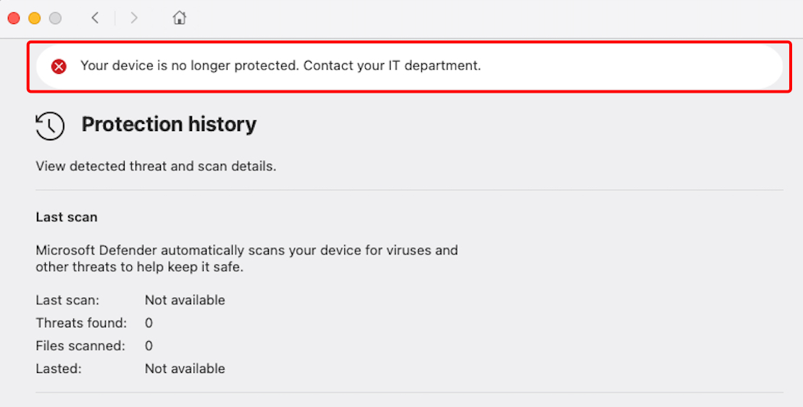
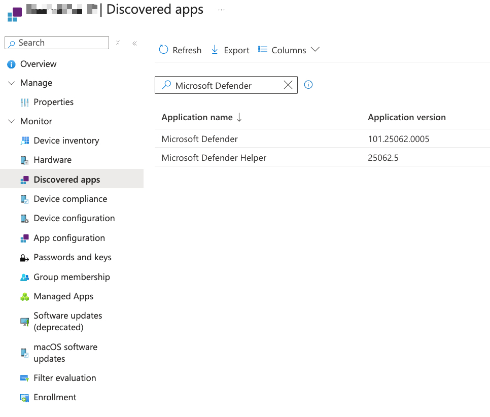
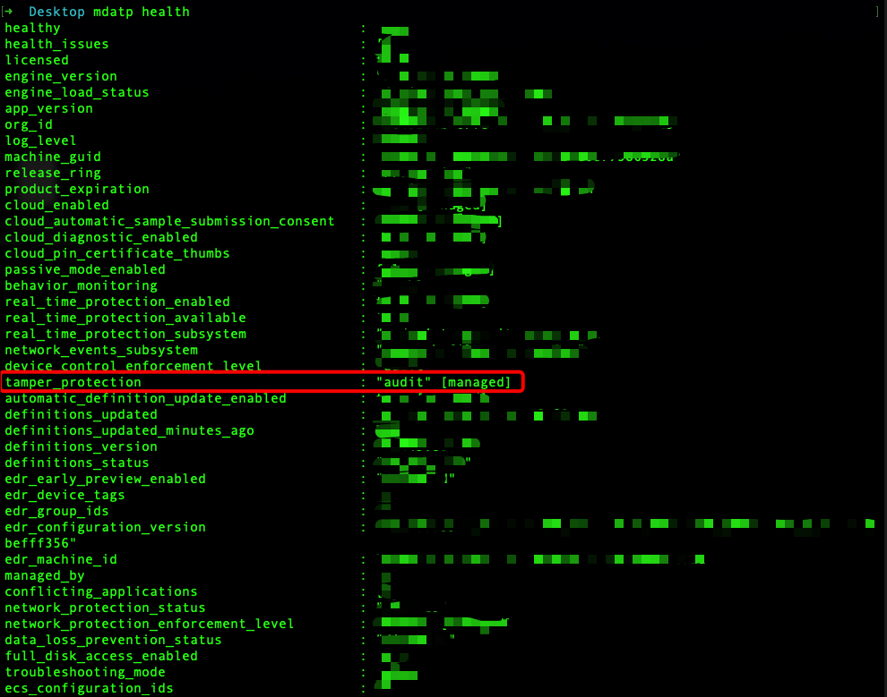
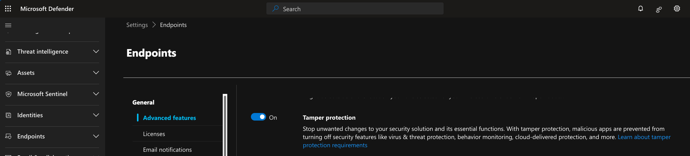
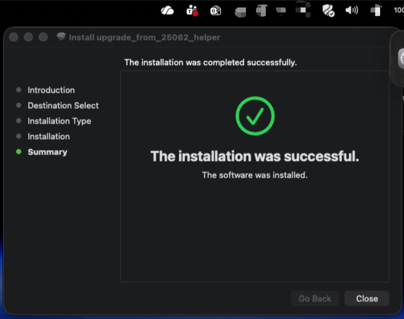

## **Defender for Endpoint Upgrade Failure on macOS — What You Need to Know**

**Are your Intune giving you a false sense of security?**

During my experience leading endpoint security operations, I have directly encountered the widespread challenge of upgrading Microsoft Defender for Endpoint on macOS devices managed via Intune.<br>
This issue which the transition from version 2506 fails silently — poses a concrete threat to an organization’s operational resilience and compliance.<br>
This guide outlines not only the documented solution, but also the investigative steps and operational safeguards I've found essential to detect and remediate devices that are not up to date with Microsoft Defender for Endpoint (MDE).


**Problem Overview and Technical Root Cause**

The upgrade process from version 2506 of Defender for Endpoint on macOS, when orchestrated through Intune, can fail silently. This leaves legacy files or partial installations which prevent successful deployment of newer versions. Endpoints may look healthy in Intune dashboards, but lack the latest security and threat protection—creating a false sense of compliance and a genuine exposure to advanced threats.

This false sense of security is not only a compliance issue but also a genuine risk for exposure to advanced threats.



Through targeted audits, I confirmed that relying solely on Intune compliance indicators can overlook entire device populations that aren’t truly up to date.

---

## Detect - How I Identified the Issue

My detection process started when users reported the Defender app icon showing a warning state.<br>


So, I decide to established a structured detection phase to identify machines not up to date with Microsoft Defender for Endpoint.

To systematically assess the environment, I exported device inventory data from Intune and compared the Defender versions deployed across the macOS fleet. <br>
This promptly revealed a subset of endpoints still running version 2506, even though Intune was reporting them as compliant.



To ensure comprehensive coverage and pinpoint any machines missed by Intune’s reporting, I complemented this analysis with a KQL query in the Defender portal. <br>
This allowed for a direct inventory of Defender versions on all macOS devices—crucial for detecting discrepancies and ensuring accuracy.

_Here the KQL Query:_

```
DeviceTvmInfoGathering
| where OSPlatform == @"macOS"
| extend mde_version = parse_json(AdditionalFields)["AvPlatformVersion"]
//if you want to identify all version comment next row
| where mde_version == "101.25062.0005"
| project DeviceName, mde_version
```

Combining visual dashboard evidence (Intune screenshot), inventory exports, and Defender KQL queries gives me a reliable and actionable overview of all macOS endpoints’ Defender status.

## Mitigate - Structured Remediation Approach

After identifying non-compliant macOS devices, I manually remediated my own Mac first to validate and document an effective upgrade path.<br>
Here a link of the suggestion coming from Microsoft documentation: [Microsoft Known-issues](https://learn.microsoft.com/en-us/defender-endpoint/mac-whatsnew#known-issues), where I was redirect to GitHub repository that explain all [GitHub_upgrade_v2506_macOS](https://github.com/microsoft/mdatp-xplat/tree/master/macos/upgrade_from_2506_helper)

On my device, I carefully went through each step of the upgrade process—removing legacy Defender files, running the official installer, and personally reviewing system logs and application status.

I first ran the command 

```mdatp health```

to inspect the installed Defender for Endpoint version and to confirm that Tamper Protection was enabled—which is the default configuration for managed devices. <br>
Tamper Protection prevents unauthorized changes to Defender’s security settings, so I needed to temporarily adjust it before proceeding with the upgrade.

In order to install the updated package from Microsoft’s GitHub repository, I disabled Tamper Protection on my device by executing:

```sudo mdatp config tamper_protection enforcement-level --value audit```




This action, allowed because I am the device owner, switches tamper protection to audit mode (alternatively, admins can change this setting via the Defender portal). With tamper protection set to audit, I was able to install the .pkg upgrade program as recommended by Microsoft, ensuring a clean transition from the legacy installation.


If you have the appropriate permissions, you can disable Tamper Protection centrally for your devices via the Microsoft Defender security portal:
1. Go to **Defender portal** -> https://security.microsoft.com
2. Go to **Settings** and select **Endpoint**
3. Find the **Tamper Protection** settings and toggle it **Off**



⚠️ _Disabling Tamper Protection for all endpoints will reduce the security posture of your organization and can expose all devices to risks such as unauthorized changes to security features, including threat and virus protection._

_This action should be performed only when strictly necessary, for the shortest possible duration, and only by authorized personnel._

**Always remember to re-enable Tamper Protection immediately after completing the required maintenance or upgrade operation.**






After completing the process on my own device and confirming that I was able to successfully update Microsoft Defender for Endpoint, I moved on to addressing all remaining devices in the organization. <br>
At this stage, manual remediation was not feasible, so I followed Microsoft’s official guidance for Intune, as referenced in their [GitHub documentation](https://github.com/microsoft/mdatp-xplat/blob/master/macos/upgrade_from_2506_helper/Intune09122025.pdf).<br>
This allowed me to automate the deployment of the upgrade helper script across all affected endpoints. The script efficiently removed legacy Defender installations, cleaned up any obsolete components, and ensured each device was ready for the latest Defender version.

After the deployment, I validated the overall success by checking Intune reports, re-running the Defender KQL query, and visually inspecting the Defender dashboards to confirm there were no remaining alerts and protection had been fully restored everywhere.

After the deployment, I validated the overall success by checking Intune reports, re-running the Defender KQL query, and visually inspecting the Defender dashboards to confirm there were no remaining alerts and that protection had been fully restored everywhere.<br> 
It’s important to note that this validation phase requires time and is by no means instantaneous—reporting data, KQL query results may take hours to reflect the latest changes across all devices in the environment. 

_For this reason, patience and repeated verification are necessary to be sure that the remediation has been successfully applied organization-wide._


---

**Sources and References:**

- Microsoft Documentation - Known Issues [**https://learn.microsoft.com/en-us/defender-endpoint/mac-whatsnew#known-issues**](https://learn.microsoft.com/en-us/defender-endpoint/mac-whatsnew#known-issues)
- Defender for Endpoint - MacOS updates [**https://learn.microsoft.com/en-us/defender-endpoint/mac-updates**](https://learn.microsoft.com/en-us/defender-endpoint/mac-updates)
- GitHub Helper MacOS version 2506 [**https://github.com/microsoft/mdatp-xplat/blob/master/macos/upgrade_from_2506_helper**](https://github.com/microsoft/mdatp-xplat/blob/master/macos/upgrade_from_2506_helper)