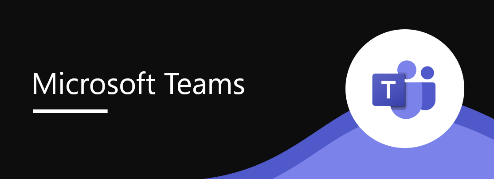
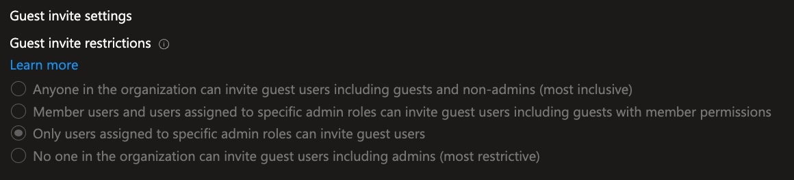
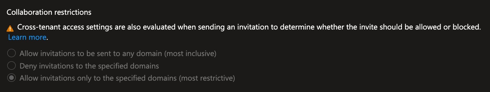
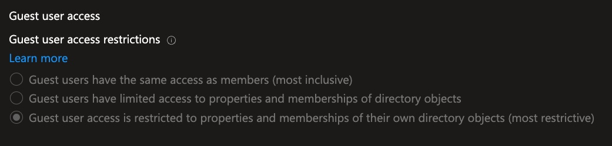

## **The New Microsoft Teams Vulnerability**

Microsoft is introducing a powerful new feature in Microsoft Teams that enables users to start chats directly with **ANYONE who has an email address**, regardless of whether they use Teams or not. The recipient will receive an email invitation to join the chat session as a guest, enabling seamless communication and collaboration without friction.

While this feature clearly offers usability benefits for external collaboration, it also introduces **significant attack vectors** if not properly managed with appropriate security controls.



**When It Arrives:**

- **Targeted Release:** Early November 2025 → Mid-November 2025
- **General Availability Worldwide:** January 2026

The feature will be **enabled by default** on all tenants, which means you need to act proactively if you want to limit or disable it.

---

## Why Should You Worry?

I'm not trying to be alarmist here, but I've seen what happens when access controls aren't thought through. 

Here are the real risks:

1. **Phishing gets a lot easier**

Your team members are going to start getting chat invitations from people who look legitimate but aren't. An attacker can impersonate your CFO, a trusted vendor, a partner organization. Once they're in as a guest, they have access to your tenant. They can gather intelligence, pressure people into sharing confidential information, exfiltrate data through chat, or scout your infrastructure for weaknesses.

2. **Governance goes out the window**

If any member of your organization can invite guests, you lose control. Shadow collaboration happens. Unauthorized partners start accessing your systems. Audit trails become useless because you can't track who created which guest. And if you're in a regulated industry-finance, healthcare, legal-you've got compliance violations waiting to happen.

3. **Insiders become a bigger threat**

A disgruntled employee or a compromised account can suddenly create multiple guest accounts from external domains they control, then coordinate attacks from both inside and outside your organization. They can share credentials, API keys, entire databases. They can set up persistent access for later exploitation.

4. **Dead guest accounts pile up**

Without proper cleanup, your tenant fills with dormant guest accounts that nobody's using anymore. They're still there. Still have access. Still represent a security risk. All it takes is one of them to be reactivated by an attacker, and you have a breach.

## How can I protect my Tenant?

Here's exactly how:

## **1️⃣ Only Admins Can Invite Guests (Guest Invite Restriction) - 🔴 HIGH PRIORITY**

By default, anyone in your organization can invite a guest. Change that!

**Why it matters:** If a regular user's account gets compromised, an attacker can create malicious guests. By limiting this to admins only, you reduce the attack surface dramatically. 3-5 security admins are way easier to protect than 100+ employees.

## How to do it?

1. Access **Microsoft Entra Admin Center** ([**https://entra.microsoft.com**](https://entra.microsoft.com/))
2. Go to **External Identities** → **External collaboration settings**
3. Scroll to **"Guest invite restrictions"**
4. "*Only users assigned to specific admin roles can invite guest users*"



**Pro tip:** Create a custom admin role with just the "Invite external users" permission and assign it to your security team. This keeps things centralized and gives you a clean audit trail.

## **PowerShell Implementation (Optional)**

```powershell
powershellConnect-MgGraph -Scopes "Policy.ReadWrite.Authorization"

*# Verify current state*
$policy = Get-MgPolicyAuthorizationPolicy
$policy.GuestInviteRestrictions

*# Update to limit to admins*
Update-MgPolicyAuthorizationPolicy -GuestInviteRestrictions "adminsAndGuestInviters"
```

---

## **2️⃣ Whitelist of Partners’ Domains (Collaboration Restriction) - 🔴 HIGH PRIORITY**

Don't allow guests from anywhere. Specify exactly which domains can be invited.

**Why it matters:** An attacker can easily register a domain that looks like your partner's or create a Gmail account. Without a whitelist, they could be invited as a guest. With a whitelist, they're automatically blocked.

## How to do it?

1. Access **Microsoft Entra Admin Center** → **External Identities** → **External collaboration settings**
2. Scroll down to **"Collaboration restrictions"**
3. "*Allow invitations only to the specified domains (most restrictive)*"
4. In the field, enter the domains of your trusted partners and clients, one per line
    
    
    

**What happens:** If someone tries to invite a guest from Gmail or any domain not on your list, the system automatically blocks it. No exceptions.

## **PowerShell Implementation (Optional)**

```powershell
powershellConnect-MgGraph -Scopes "Policy.ReadWrite.Authorization"

*# View current configuration*
$policy = Get-MgPolicyAuthorizationPolicy
$policy.AllowedToSignUpEmailBasedSubscriptions
```

---

## **3️⃣ Limit Guest Access (Guest User Access Restrictions) - 🟡 MEDIUM PRIORITY**

Even with access controls, a guest shouldn't be able to see your entire directory.

**Why it matters:** If a guest account gets compromised, the attacker can use it to map your organization, find high-value targets, and launch phishing attacks. If they can only see themselves, the damage is limited.

## **How to do it?**

1. Access **Microsoft Entra Admin Center** → **External Identities** → **External collaboration settings**
2. Scroll to **"Guest user access restrictions"**
3. "*Guest user access is restricted to properties and memberships of their own directory objects (most restrictive)*"



**What changes:** Guests can still access the specific Teams chats and SharePoint sites you've shared with them. But if they try to browse "People" or look at the organizational chart, they get nothing. If they're compromised, they can't reconnaissance your infrastructure.

**Practical example:**

- Guest invited to Teams chat: ✅ Can access chat and specific attachments
- Guest tries to go to "People" and search users: ❌ Sees empty list
- Guest attempts to access shared SharePoint: ✅ Access allowed only to specific resources

---

## **4️⃣ Disable B2B Guest Chat in Teams - 🔴 HIGH PRIORITY**

This is the most direct control. Just turn it off.

**Why it matters:** Even with all the other controls, the feature itself is enabled by default. By disabling it, you're saying "this chat-with-anyone feature doesn't exist in my environment" until you explicitly enable it.

## How to do it?

1. Access **Teams Admin Center** ([**https://admin.teams.microsoft.com**](https://admin.teams.microsoft.com/))
2. In the left menu, go to **Users** → **External Access**
3. Select the **Global (Org-wide default)** policy
4. Scroll down to find **"Use B2B invites to add external users"**
5. Click **Save**

**What happens:** Your users won't even see the option to start a chat with an external email address. If an admin tries to do it, it fails silently. When Microsoft rolls out the feature in November, your environment stays protected because it's already disabled.

## **Important Note: Custom Policies**

If you've created **custom messaging policies** for specific users, you must disable the feature in those policies as well:

```powershell
powershellConnect-MicrosoftTeams

*# View all custom policies*
Get-CsTeamsMessagingPolicy | Where-Object {$_.Identity -ne "Global"}

*# Disable for all policies*
Get-CsTeamsMessagingPolicy | Set-CsTeamsMessagingPolicy -UseB2BInvitesToAddExternalUsers $false
```

---

## **5️⃣ Conditional Access Policy with MFA - 🔴 HIGH PRIORITY**

This is your final line of defense: even if a guest account exists, they need both MFA and a compliant device to access anything.

**Why it matters:** A compromised guest password alone isn't enough to access your environment. An attacker would need to either have the MFA device or convince the guest to provide their second factor. And if the device isn't compliant (not registered in your MDM, no antivirus, etc.), access is denied anyway.

# **How to do it?**

1. Access **Microsoft Entra Admin Center** ([**https://entra.microsoft.com**](https://entra.microsoft.com/))
2. In the left menu, go to **Protection** → **Conditional Access**
3. Open your existing MFA policy (or create a new one if you don't have one)
4. Click **Assignments** → **Users and groups**
5. Verify the following are included:
    - ✅ "Guest or external users"
    - ✅ "B2B collaboration guest users"
6. Go to **Grant conditions**
7. Ensure the following are checked:
    - ✅ "Require multifactor authentication"
8. Click **Save**

## **Conclusion**

The B2B Chat feature itself isn't bad. It's actually useful for collaborating with external partners. The problem is that "**enabled by default**" nonsense. Microsoft should have made this opt-in, not opt-out.

This is your heads-up. **Don't wait for the January 2026 rollout**. Get these controls in place now, test them, make sure your legitimate workflows still work, and then you can sleep at night knowing this particular attack vector is sealed off.

If you have questions about implementing these controls in your specific environment, feel free to reach me out!

---

**Sources and References:**

- Microsoft Entra ID B2B Collaboration: [**https://learn.microsoft.com/en-us/entra/external-id/**](https://learn.microsoft.com/en-us/entra/external-id/)
- Teams Messaging Policies: [**https://learn.microsoft.com/en-us/microsoftteams/messaging-policies-in-teams**](https://learn.microsoft.com/en-us/microsoftteams/messaging-policies-in-teams)
- Conditional Access Documentation: [**https://learn.microsoft.com/en-us/entra/identity/conditional-access/**](https://learn.microsoft.com/en-us/entra/identity/conditional-access/)
- M365 Admin Blog: [**https://m365admin.handsontek.net/microsoft-teams-chat-anyone-email-address-2/**](https://m365admin.handsontek.net/microsoft-teams-chat-anyone-email-address-2/)