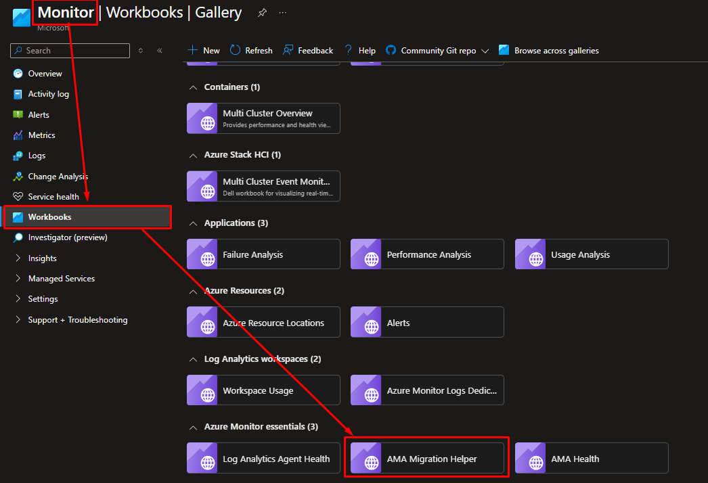
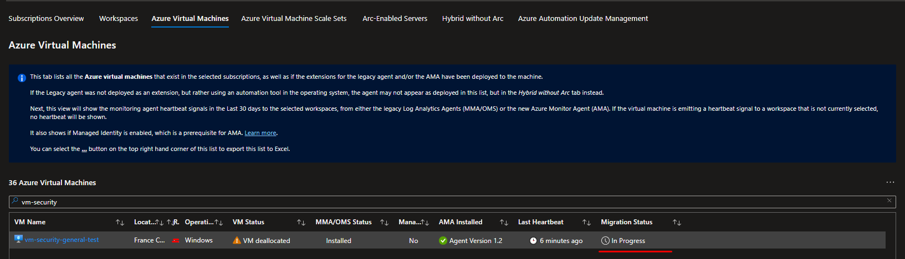

# Migration from MMA to AMA and DCR configuration + Azure Policy

Microsoft has announced the deprecation of the **Microsoft Monitoring Agent** (MMA), effective August 31. If you're still using MMA to collect and manage your monitoring data, now is the time to plan your transition to **Azure Monitor Agent** (AMA).


The **MMA** will officially be deprecated on **August 31**. Although MMA will continue to be active for logging purposes until 1 of February, it’s important to note that Microsoft will not provide support for any issues encountered after August 31.

Therefore, to ensure uninterrupted support and to take advantage of the latest features, you should complete your migration to AMA before the deprecation date.


The Azure Monitor Agent represents a significant advancement in monitoring capabilities, offering enhanced performance, security, and flexibility. Microsoft recommends migrating to AMA to take advantage of these improvements and ensure continued support for your monitoring needs.

In this post, we’ll guide you through the migration process by showing you how to configure and install the new Azure Monitor Agent, set up **Data Collection Rules** (DCR), and apply Azure policies to automate the deployment of both the AMA agent and DCR. This step-by-step guide will ensure a seamless transition and help you leverage the latest monitoring technology efficiently.

**Content**

1. AMA Migration Workbook
2. Agent Installation - Creation of DCR
3. Azure Policy
4. Conclusion

### 1. AMA Migration Workbook

To get a comprehensive view of all the VMs, Azure Arc resources, and VMSS that need to be migrated to the new Azure Monitor Agent (AMA), you can use this workbook.

Navigate over Monitor Service on Azure → Workbooks → AMA Migration Helper

Here you can find the migration status, with all the machines to be migrated categorized by different resource types. The workbook highlights:

- <strong>In blue:</strong> Agents with both agents.
- <strong>In red:</strong> Agents with only MMA/OMS.
- <strong>In green:</strong> Agents with only AMA.

Within each tab, you can also see detailed status updates for agent installations on each VM, Azure ARC or VMSS highlighting the specific installation status.


This workbook can be very useful as it provides detailed insights into the agent installations allowing you to view each installation in detail.


### 2. Agent Installation - Creation of DCR (Windows)


You need to create the DCR from Sentinel Connector


*Naviga su Sentinel → Data Connector → Windows Security Events via AMA*

Open connector page

Here tou can create your DCR


What I recommend is creating separate Data Collection Rules for each type of host, such as Windows and Linux (use Syslog via AMA), and also **dividing the DCRs for other groups of machines**. This approach ensures that you have DCRs with specific events tailored to different types of hosts


Define Name for the DCR and Resource Group where is stored (default will be Sentinel)

In the Resources tab select all the VM and Azure Arc that you want to monitoring.

After all you need to select with kind of event you want to store.


To better understand what to ingest, here you can find **guides** that describe in detail what each tab represents.
- **Windows** → [Windows Security Event Reference](https://learn.microsoft.com/en-us/azure/sentinel/windows-security-event-id-reference)
- **Linux** → [Configure Syslog in Azure portal](https://learn.microsoft.com/en-us/azure/azure-monitor/agents/data-sources-syslog#configure-syslog-in-the-azure-portal)
- **Deep Dive on Linux event** → [How to debug Syslog ingestion](https://techcommunity.microsoft.com/t5/core-infrastructure-and-security/deep-dive-how-to-debug-syslog-ingestion-for-sentinel-and-log/ba-p/2007056)


After all click on Create and wait the creation of DCR and the deploy of AMA over VM and Azure ARC.

- Evidence of DCR created over DCR services

- Evidence of AMA installation on VM


**Remember to unistall the MMA agent**, as having it active could result in duplicate events within your workspace.



### 3. Azure Policy

Azure Policy can be used to deploy the Azure Monitor Agent. To achieve this, follow these steps:

1. **Navigate to the Azure Policy Section:** Access the Azure portal and go to the "Policy" section from the left-hand menu.
2. **Create a New Policy:** In the Azure Policy dashboard, select "Create Policy" to start the process of defining a new policy.
3. **Configure the Policy:** Set up the policy parameters to deploy the Azure Monitor Agent. You can specify the conditions under which the agent should be installed and apply it to the appropriate scope, such as specific resource groups or subscriptions.
4. **Assign the Policy:** Once configured, assign the policy to the desired resources. This will ensure that the Azure Monitor Agent is automatically installed on all resources that meet the policy criteria.


Here you can find **guides** that describe in detail the Azure Policy.
There are built-in policy initiatives for Windows and Linux virtual machines [Azure Policy](https://learn.microsoft.com/en-us/azure/azure-monitor/agents/azure-monitor-agent-policy#built-in-policy-initiatives)


Within these two rules, I recommend selecting exclusively the following two policies that are essential for installing the Azure Monitor Agent (AMA) and assigning the Data Collection Rule (DCR) to the VM:

1. **Policy for Installing the Azure Monitor Agent (AMA):** This policy ensures that the AMA is automatically deployed on the targeted virtual machines. It simplifies the installation process by applying the agent configuration across your environment.
2. **Policy for Assigning Data Collection Rules (DCRs):** This policy is responsible for applying the appropriate DCR to each VM. It guarantees that the data collection settings are consistently applied, enabling accurate and comprehensive monitoring.
    
    
    

1. **Policy for Installing the Azure Monitor Agent (AMA)**

Starting for the first one click on *Configure Windows virtual machines to run Azure Monitor Agent with user-assigned managed identity-based authentication* and click on Assign

Here you need to select the Scope where the Policy will be executed.

For example you can also select all Subscption or even specific Resource Group.


You can also build an Exclusions path to ensure that you do not unintentionally apply the policy you are creating.


Skip the Advances step

On Parameters step set Bring Your Own User-Assigned Managed Identity as True

In the Remediation tab, enter a **user-assigned managed identity** and check the box for "Create Remediation Task." This will ensure that the policy uses the specified identity and sets up a remediation task if needed.


Create **user-assigned managed identity** in order to have a identity that have the correct permission to install AMA and also assign the DCR.

**Required permissions:**  [Create and Edit DCR](https://learn.microsoft.com/en-us/azure/azure-monitor/essentials/data-collection-rule-create-edit?tabs=portal#permissions)

Navigate over Managed Identities and click on Create

After creating it, remember to add the required permissions in the Azure Role Assignments section.

*Role example (here I add owner just for a test)*




Remember that adding the Remediation tab allows the policy to be applied to existing VMs as well. 
Without this tab, the policy would only apply to new VMs created after the policy is implemented


Here you can add a message if the policy will be non-compliante

Then in review + create tab click on **Create**


Policy are not really fast so you need to wait 10-15 minute untill it will be applied.


Inside the Compliance tab you can monitoring the policy status and the non-compliance resources or non-compliant policies.

Click on it you can see the real evidence of the policy status and the affected machine.


If the policy returns an error and is marked as non-compliant, use the Remediation Task tab to reapply the policy.

Within the Remediation tab, you can monitor the progress of the remediation.



2. **Policy for Assigning Data Collection Rules (DCRs)**

Starting for the first one click on *Configure Windows Machines to be associated with a Data Collection Rule or a Data Collection Endpoint* and click on assign

As previously done, configure the required sections.

Skip the Advanced tab

In the Parameters tab insert the ID of the DCR created in the **Step 2**


How to find DCR ID?

Click on DCR Service and find click on JSON View

Click on *Copy*



As previously use the User Assigned managed Identity created before with all the role permission

Add comment if you want and click on create policy


Policy are not really fast so you need to wait 10-15 minute untill it will be applied.


Inside the Compliance tab you can monitoring the policy status and the non-compliance resources or non-compliant policies.

### Conclusion
In conclusion, migrating from the Microsoft Monitoring Agent (MMA) to the Azure Monitor Agent (AMA) represents a significant upgrade to your monitoring infrastructure. By creating Data Collection Rules (DCRs) and leveraging Azure Policy for automated deployment, you can streamline the process and ensure consistent and comprehensive monitoring across your environment.

The migration involves several key steps: setting up the new AMA, defining and configuring DCRs to suit your specific monitoring needs, and applying Azure Policies to automate the deployment and assignment of both the AMA and DCRs. This approach not only simplifies the transition but also enhances the efficiency and effectiveness of your monitoring setup.

By following these guidelines, you will benefit from improved performance, increased flexibility, and better support for your monitoring requirements. Ensure that you complete the migration before the deprecation of MMA to avoid any disruptions and to fully leverage the advanced features and capabilities of AMA


If you have any questions or need further assistance, feel free to contact me via [LinkedIn](https://www.linkedin.com/in/roberto-d-andrea-347164183/).
I’m here to help with any queries you may have about the migration process.

Feel free to adjust the contact details or add any additional information as needed.

