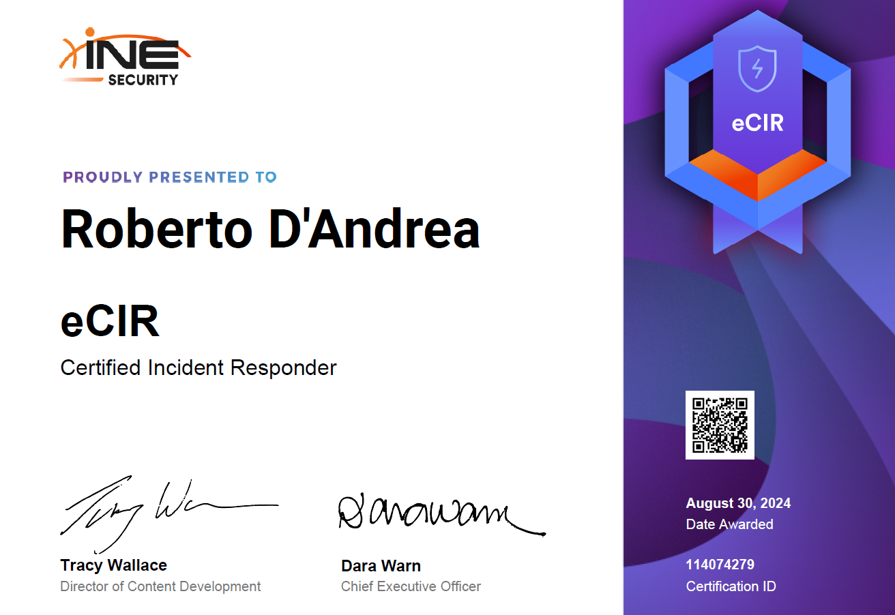

The **Certified Incident Responder (eCIR)** by INE is a certification designed for professionals specializing in incident response and forensic investigations.

This certification is tailored for cybersecurity practitioners who aim to deepen their skills in identifying, containing, and remediating security incidents effectively. Priced at **400$**, the certification includes a practical exam lasting **two days**, followed by an additional **two days** to submit the final report detailing your findings.

This review includes personal notes and an example of the methodologies applied during the exam.


In this section, I’ve included some of my notes to help guide others studying for the eCIR certification. 
These notes summarize key takeaways from each module, covering essential techniques, tools, and strategies for threat hunting within networks and endpoints. 
- **eCIR Certification Notes** → [eCIR Notes](https://www.notion.so/robertodandrea/eCIR-Certification-Notes-13f6583d22bc8011b509deb641f4ad0d?source=copy_link)


### Certification Breakdown

1. **Incident Preparedness and Management**:
    - Learn to design and implement incident response plans.
    - Key topics include identifying **Indicators of Attack (IoA)** and **Indicators of Compromise (IoC)** and leveraging automated playbooks for response.
    - Focus is placed on integrating frameworks like **NIST** and **MITRE ATT&CK** into workflows.
2. **Threat Intelligence Integration**:
    - Leverage tools such as **Splunk** and **ELK (Elastic)** for correlation, log aggregation, and monitoring threat intelligence feeds.
    - Hands-on practice includes creating custom dashboards to visualize incidents and measure their impact.

### Exam Structure

The **eCIR certification exam** is divided into two **hands-on parts**, simulating real-world incident response scenarios:

1. **Part 1: Splunk**
    - Focuses on using Splunk to analyze compromises that occurred on specific endpoints within a network.
    - Candidates must identify anomalies and understand how the compromise propagated through the environment.
2. **Part 2: ELK**
    - Centers on leveraging the ELK stack for log correlation and advanced analysis.
    - A **PCAP file** is provided in this part, containing captured traffic from the attack, which must be analyzed to extract critical details about the intrusion.

Candidates are required to document their findings in a comprehensive report, demonstrating their ability to follow a structured methodology. This report must be submitted within **two days** of completing the practical portion.


This certification, in my experience, presents a medium-to-low difficulty level, especially if you are already familiar with tools like Splunk, ELK and Wireshark. 
My approach was to methodically investigate each host present in the network by analyzing possible Windows Security Log Events. 
From there, I built my understanding and followed up with targeted investigations, leveraging my prior knowledge of these tools. The hands-on nature of the exam and the need for a structured methodology made the process both challenging and rewarding.


1. **Master Core Tools**: Familiarize yourself deeply with Splunk, ELK. Focus on advanced features like custom queries, regex, and anomaly detection patterns.
2. **Analyze PCAP Files**: Practice using tools like Wireshark to analyze network traffic, especially for identifying malicious communications.
3. **Time Management**: Allocate time for each part of the exam and reserve a buffer for writing the report.
4. **Leverage MITRE ATT&CK**: Use this framework to map attack techniques and provide structured context in your report.
5. **Take Detailed Notes**: During the labs, document every step. These notes will help streamline your report writing and ensure you don’t miss critical details.

[Letter of Engagement (PDF)](eCIR_Letter_of_Engagement.pdf)
[Wireshark (PCAP)](scenario2-traffic-capture.pcap)

### Conclusion

INE's **eCIR certification** is an excellent opportunity for cybersecurity professionals to enhance their incident response and forensic skills. By mastering tools like `Splunk`, `ELK` and `Wireshark`, candidates gain practical expertise in handling real-world security incidents.

With its focus on hands-on learning, structured methodologies, and real-world data analysis (including PCAP files), the certification provides invaluable insights into modern incident response practices.